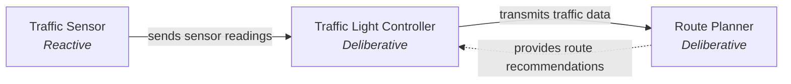
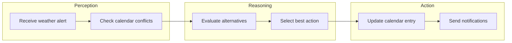

# Contract: Interaction Map & Capability Cycle

## Module
`module_1_foundations.interaction_map.mapper`

### `generate_interaction_map(scenario: Scenario) -> str`

Returns a Mermaid flowchart string from a `Scenario` object.

**Input**: `Scenario` with `agents` and `interactions`
**Output**: Mermaid syntax string:

**Edge Cases**:
- Zero interactions → returns flowchart with isolated agent nodes (no arrows)
- Unidirectional → single solid arrow (`-->`)
- Bidirectional / feedback loops → dashed arrow (`-.->`) with `feedback_loop` label

---

### `generate_capability_cycle(scenario: Scenario, agent_id: str) -> str`

Returns a Mermaid flowchart string modeling the perception → reasoning → action cycle for a specific agent.

**Input**: `Scenario`, `agent_id` (must reference an agent in the scenario)
**Output**: Mermaid flowchart with subgraphs for each phase:

**Edge Cases**:
- Unknown `agent_id` → raises `ValueError`
- Agent with no scenario context → raises `ValueError`
